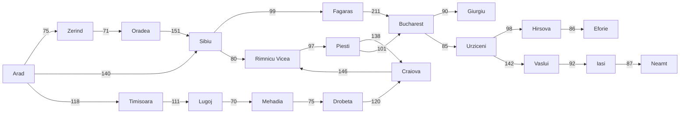

# Python search algorithms

Contained within this repo is the code for basic: 

* Breadth First Search
* Bidirectional Search
* Depth First Search
* Greedy Best First Search
* A* Search
* Bounded Cost Search

More ML ones coming soon...

## Algorithm visualisation 
This graph will be used in all future algorithms (and existing will be updated to use this too)

## Breadth First Search Output:
Arad  -->  Zerind  -->  Sibiu  -->  Timisoara  -->  Ordea  -->  Fagaras  -->  0.23

## Depth First Search Output:
Arad  -->  Timisoara  -->  Lugoj  -->  Mehadia  -->  Drobeta  -->  Craiova  -->  Rimmnicu Vicea  --> ERROR due to circular path
